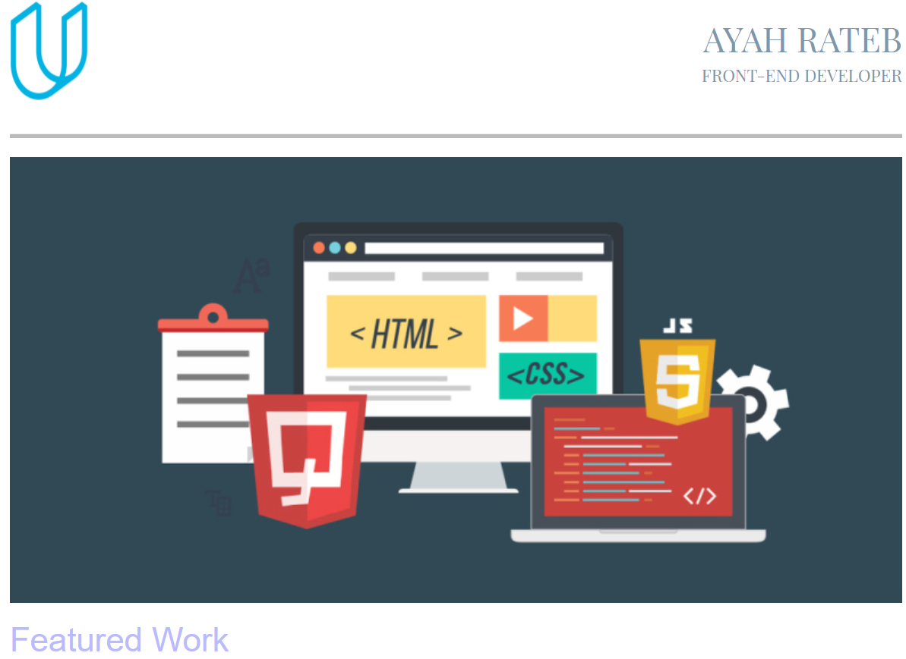

# portfolio

## Description:
Converting a design mockup as a PDF-file to a responsive website.

  

## Languages used:
- HTML
- CSS  
## Framework used: 
- Bootstrap 
 
 ## To see it clone the repository and run the index.html file in your browser
